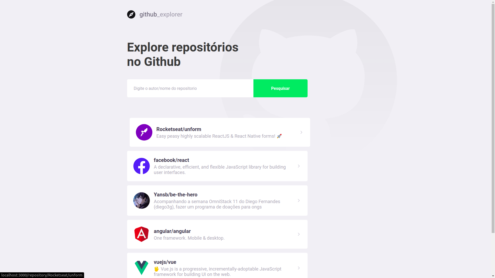
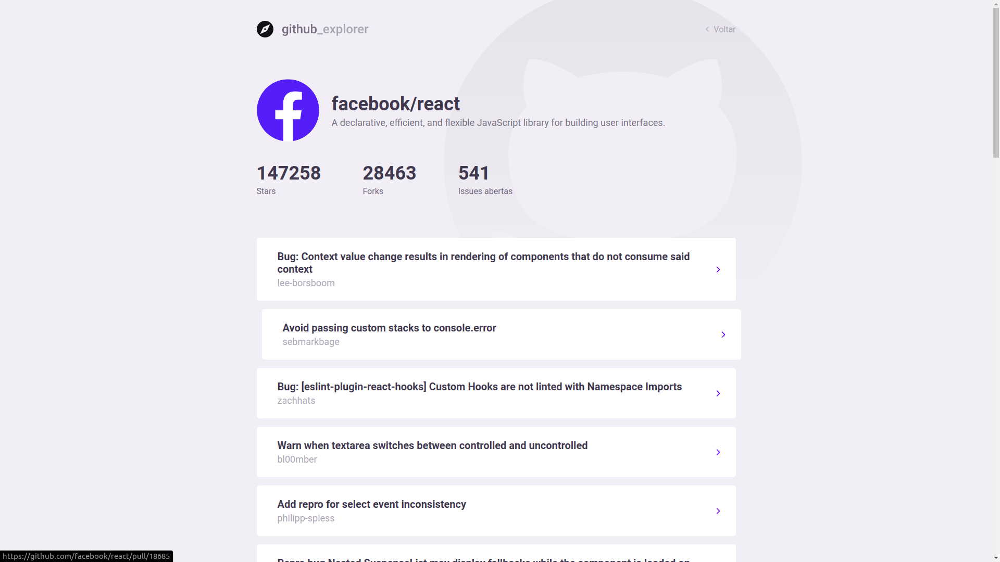

  

 

## O que é
  Uma aplicação que utiliza a api do github para listar os respositorios e suas issues,
  ao clickar em uma issue ele leva para a pagina do github com as informações sobre a issue

  
   
   
  

## Como Testar
  1- Você precisa ter o node e o yarn instalados
   
  2- Depois de clonar o projeto deve ir na pasta raiz e usar o comando 'yarn' no terminal
   
  3- No terminal use o `yarn start`
   
  4- Adicione Repositórios no formato '(nome_do_criador_do_repositorio / nome_do_repositório)'
  exemplo: 'Yansb/github_explorer'

 
 
 

aplicação criada seguindo o Bootcamp GoStack da Rocketseat com o intuito de aprender a desenvolver front end usando React e Typescript
